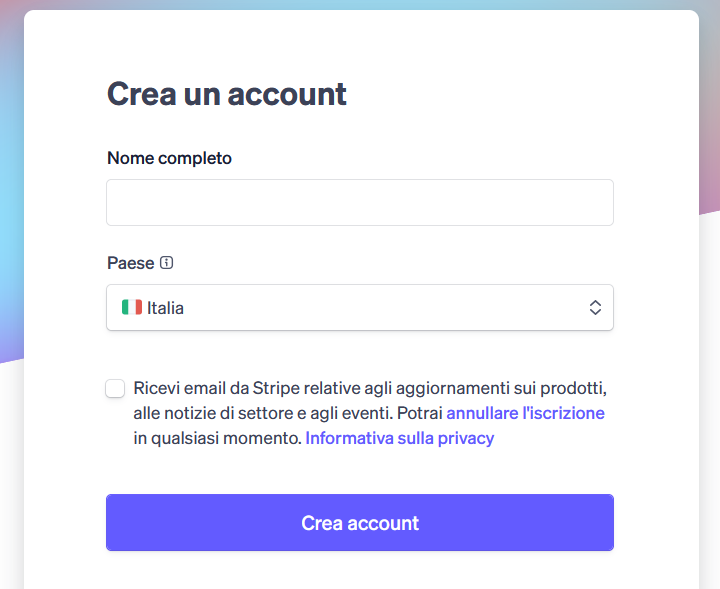
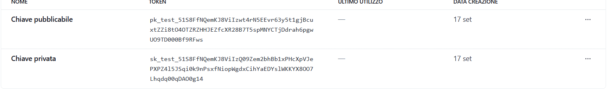
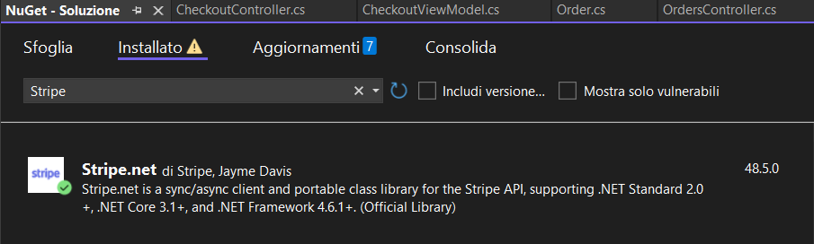

# Guida all'Implementazione di Stripe su ASP.NET Core 🚀

Questa guida ti mostrerà passo dopo passo come integrare il sistema di pagamento **Stripe** nella tua applicazione **ASP.NET Core**. Prima di iniziare, assicurati di avere già un'applicazione web con un negozio, un sistema di checkout e un sistema di gestione degli account utente già funzionanti.

---

## 1. Configurazione dell'Account Stripe 🔑

Il primo passo è creare un account Stripe in modalità "sandbox" per i test.

1.  **Registrati** sul [sito ufficiale di Stripe](https://stripe.com/). Puoi accedere rapidamente utilizzando il tuo account Google.

2.  Completa il processo di creazione dell'account.

3.  Una volta completato, clicca su **"Vai alla sandbox"** per attivare l'ambiente di test. !

4.  Nel menu di navigazione, seleziona **"Sviluppatori"** e poi **"Chiavi API"**.


---

## 2. Inserimento delle Chiavi API nell'Applicazione 📝

Ora che hai le tue chiavi, le utilizzeremo per connettere la tua applicazione a Stripe.

1.  Copia le due chiavi (la **Chiave Segreta** e la **Chiave Pubblicabile**) dalla console di Stripe.

2.  Nel tuo progetto ASP.NET Core, apri il file `appsettings.json` e aggiungi la seguente sezione per memorizzare le chiavi:

    ```json
    "Stripe": {
      "SecretKey": "sk_test_...", // Incolla qui la tua Chiave Segreta
      "PublishableKey": "pk_test_..." // Incolla qui la tua Chiave Pubblicabile
    }
    ```

Ora la tua applicazione è pronta per interagire con l'API di Stripe!

---

## 3. Installazione della Libreria Stripe 📦

Per poter utilizzare l'API di Stripe nel tuo codice, devi installare la libreria ufficiale.

1.  In Visual Studio, vai su **Strumenti** → **Gestione Pacchetti NuGet** → **Gestisci pacchetti NuGet per la soluzione...**.

2.  Cerca il pacchetto **`Stripe.net`** e installalo nel tuo progetto.


---

## 4. Configurazione del Controller di Checkout 🛠️

Iniziamo a scrivere il codice per gestire il processo di pagamento.

1.  Nel tuo controller di **Checkout**, importa le librerie necessarie:

    ```csharp
    using Stripe;
    using Stripe.Checkout;
    ```

2.  Aggiungi le seguenti righe all'inizio del tuo controller. Assicurati di sostituire `ApexVolleyContext` con il tuo `DbContext`.

    ```csharp
    private readonly ApexVolleyContext _context;
    private readonly IConfiguration _config;

    public CheckoutController(ApexVolleyContext context, IConfiguration config)
    {
      _context = context;
      _config = config;
      // Inizializza la chiave segreta di Stripe
      StripeConfiguration.ApiKey = _config["Stripe:SecretKey"];
    }
    ```

---

## 5. Creazione di una Sessione di Pagamento Stripe 🛒

Stripe Checkout reindirizza i clienti su una pagina di pagamento sicura ospitata da Stripe, semplificando il processo.

1.  Crea un'istanza di `SessionCreateOptions` per definire i dettagli del pagamento. Questo include il prezzo, i nomi dei prodotti e le quantità.

    ```csharp
    var options = new SessionCreateOptions
    {
      PaymentMethodTypes = new List<string> { "card" },
      LineItems = cart.Select(c => new SessionLineItemOptions
      {
        PriceData = new SessionLineItemPriceDataOptions
        {
          UnitAmount = (long)(c.Product.Price * 100), // Prezzo in centesimi
          Currency = "eur",
          ProductData = new SessionLineItemPriceDataProductDataOptions
          {
            Name = c.Product.Name
          }
        },
        Quantity = c.Quantity
      }).ToList(),
      Mode = "payment",
      // URL di reindirizzamento dopo il successo o l'annullamento
      SuccessUrl = Url.Action("Success", "Checkout", new { orderId = order.Id }, Request.Scheme),
      CancelUrl = Url.Action("Index", "Checkout", null, Request.Scheme),
      ClientReferenceId = order.Id.ToString()
    };
    ```

2.  Crea la sessione e reindirizza l'utente:

    ```csharp
    var service = new SessionService();
    var session = service.Create(options);

    if (session == null || string.IsNullOrEmpty(session.Url))
    {
      TempData["ErrorMessage"] = "Errore nella creazione del pagamento.";
      return RedirectToAction("Index");
    }

    return Redirect(session.Url);
    ```

---

## 6. Gestione del Successo e dell'Annullamento del Pagamento ✅

Dopo il pagamento, Stripe reindirizza l'utente agli URL che hai specificato.

1.  Crea un'azione per gestire il successo del pagamento. In questo esempio, l'utente viene reindirizzato alla pagina dei dettagli dell'ordine.

    ```csharp
    [HttpGet]
    public IActionResult Success(int orderId)
    {
      TempData["SuccessMessage"] = "Pagamento completato! Il tuo ordine verrà processato.";
      return RedirectToAction("Details", "Orders", new { id = orderId });
    }
    ```

---

## 7. Installazione Stripe-CLI ⏬

Per verificare che il pagamento sia andato a buon fine, dovrai usare un **webhook**, per usare il webhook i server stripe mandano la conferma che il pagamento è stato effettuato. In ambiente di sviluppo, useremo **Stripe-CLI** per simulare la comunicazione con Stripe.

1.  **Installa Stripe-CLI**: vai alla [pagina GitHub per il download di Stripe-CLI](https://github.com/stripe/stripe-cli/releases) e scarica la versione appropriata per il tuo sistema operativo (ad es., `windows_x86_64`).

2.  Estrai il file `.zip` in una cartella a tua scelta.

3.  Cerca e apri lo strumento per modificare le **variabili d'ambiente** del sistema.

4. Premere "Variabili d'ambiente".


5.  Seleziona `Path` sotto variabili di sistema e premi modifica.


6. Premere "Nuovo" e inserire il percorso della cartella estratta di stripe-CLI.


7. Uscire premendo OK

---

## 8. Configurazione WebHook Stripe 🕸

Adesso dovremo implementare il webhook dentro la nostra app, e confermare l'ordine appena il segnale del pagamento arriva.

1. Crea un nuovo controller nello stesso file del controller checkout, ci permetterà di gestire il segnale di Stripe. Ricordati di cambiare il contesto del database

```csharp
    [AllowAnonymous]
[Route("api/stripe/webhook")]
[ApiController]
public class StripeWebhookController : ControllerBase
{
    private readonly ApexVolleyContext _context;
    private readonly IConfiguration _config;
    private readonly ILogger<StripeWebhookController> _logger;

    public StripeWebhookController(ApexVolleyContext context, IConfiguration config, ILogger<StripeWebhookController> logger)
    {
        _context = context;
        _config = config;
        _logger = logger;
    }
}
```

2. Apri un nuovo cmd e digita. Ricorda di modificare l'indirizzo/la porta a quello del tuo sito. Non chiudere il cmd in quanto Stripe-CLI dovrà rimanere in ascolto per i pagamenti in fase di test

```batch
    stripe listen --forward-to http://localhost:8080/api/stripe/webhook
```

3. Stripe-CLI ci darà la chiave per verificare gli eventi webhook, sarà necessario copiarla per inserirla nella nostra applicazione


4. Copiare la chiave nell'appsettings.json sotto una nuova sezione

```json
    "Stripe": {
	  "SecretKey": "sk_test_...",
	  "PublishableKey": "pk_test_...",
	  "WebhookSecret": "whsec_..." //Inserisci qui la chiave Webhook
	}
```

5. Aggiungere un nuovo metodo post per gestire il messaggio di stripe, modificando come necessario il metodo. Nel mio caso vado eliminare il carrello attuale e a modificare lo stato dell'ordine da "Pending" a "Pagato" in modo che lo staff sa che è stato pagato correttamente
	

```csharp
	[HttpPost]
    public async Task<IActionResult> Index() {
		var json = await new StreamReader(HttpContext.Request.Body).ReadToEndAsync();
		var signature = Request.Headers["Stripe-Signature"];

		try
		{
			_logger.LogInformation("➡️ Webhook Stripe chiamato");
			var stripeEvent = EventUtility.ConstructEvent(json, signature, _config["Stripe:WebhookSecret"]);
			_logger.LogInformation("Evento Stripe ricevuto: {EventType}", stripeEvent.Type);

			if (stripeEvent.Type == "checkout.session.completed")
			{
				var session = stripeEvent.Data.Object as Stripe.Checkout.Session;

				if (session == null)
				{
					_logger.LogWarning("Session è null, impossibile elaborare l'evento");
					return Ok();
				}

				_logger.LogInformation("Webhook ricevuto - SessionId: {SessionId}, PaymentStatus: {PaymentStatus}, ClientReferenceId: {ClientReferenceId}",
					session.Id, session.PaymentStatus, session.ClientReferenceId);

				if (string.IsNullOrEmpty(session.ClientReferenceId))
				{
					_logger.LogWarning("ClientReferenceId non impostato");
					return Ok();
				}

				var orderId = int.Parse(session.ClientReferenceId);

				var order = await _context.Orders
					.Include(o => o.OrderItems)
					.FirstOrDefaultAsync(o => o.Id == orderId && o.Status == "Pending");

				if (order != null && session.PaymentStatus == "paid")
				{
					order.Status = "Pagato";
					order.StripeSessionId = session.Id;

					var cart = await _context.CartItems
						.Where(c => c.UserId == order.UserId)
						.ToListAsync();
					_context.CartItems.RemoveRange(cart);

					await _context.SaveChangesAsync();
					_logger.LogInformation("Ordine {OrderId} aggiornato a Pagato e carrello rimosso", order.Id);
				}
				else
				{
					_logger.LogWarning("Ordine non trovato o pagamento non completato");
				}
			}

			return Ok();
		}
		catch (StripeException ex)
		{
			_logger.LogError(ex, "Errore durante l'elaborazione del webhook Stripe");
			return BadRequest();
		}
		catch (Exception ex)
		{
			_logger.LogError(ex, "Errore generico nel webhook Stripe");
			return BadRequest();
		}
}
```

Adesso si avrà un sistema di pagamento completamente funzionante per test
Stripe-CLI dovrà essere tenuto in listening per fare funzionare il pagamento
Se si vuole guadagnare bisognerà passare all'account live ma sarà necessario collegare stripe al proprio conto bancario


Dimostrazione pagamento per test


Spero che questa guida ti sia utile per integrare i pagamenti Stripe nella tua applicazione!
